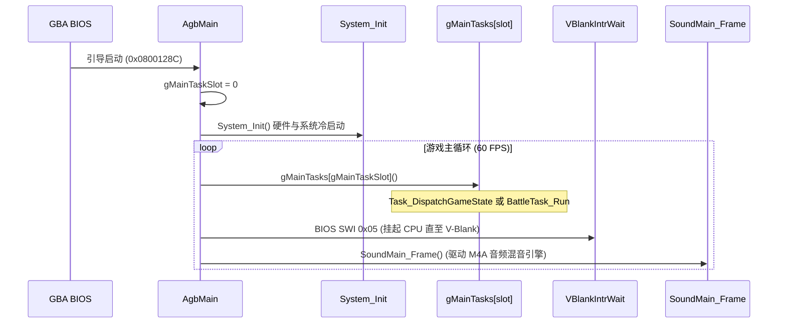

# AgbMain 主循环架构与菜单槽位状态管理器逆向分析报告

> **工程**: 《Lunar Legend (Japan)》GBA ROM 逆向与源码全量反编译  
> **作者**: Antigravity  
> **日期**: 2026-09-07  
> **状态**: 100% 逐字节匹配 (746/1059, 70.4%), SHA1 验证通过  
> **约束说明**: 独立新建逆向分析文档，不修改或追加历史旧文档。

---

## 1. 架构全景与核心结论

通过对游戏执行入口 `AgbMain`（位于 `src/engine_core.c:853`，地址 `0x0800128C`）及其系统初始化流水线 `System_Init` 的系统性静态逆向与数据流追踪，我们彻底厘清了游戏顶层主循环架构以及系统冷启动时调用的状态复位函数 **`sub_8021130`** 的真实业务含义：

1. **`AgbMain` 架构模型**:
   - 采用**双任务插槽模式（Dual Task Slot Model）**：`gMainTasks[gMainTaskSlot]()`。
   - 插槽 0 (`Task_DispatchGameState`) 承载游戏常规世界逻辑（包含 14 个游戏主状态，如地图探索、剧情对话、菜单等）。
   - 插槽 1 (`BattleTask_Run`) 承载独立战斗引擎主循环。
   - 严格遵循 GBA 标准主循环设计：**任务执行 $\to$ `VBlankIntrWait()` 低功耗等待 $\to$ `SoundMain_Frame()` 音频驱动**。

2. **`sub_8021130` 真正语义 —— `MenuSlot_ResetAll`**:
   - 过去曾被推测为场景对象或图块动画（TileAnim），经过对关联函数 `sub_8021184`（状态同步）与 `sub_80212B4`（按键光标/滚动导航）的完整逆向，证实其物理实质是**UI 菜单选择与滚动窗口槽位状态管理器（Menu Cursor & Scroll Window Slot Manager）**。
   - 维护 10 组菜单槽位（`gMenuSlotStates[10][5]`，总计 50 字节，精确覆盖 IWRAM `0x03000788` ~ `0x030007BA`）以及 1 个全局主菜单光标暂存变量 `gMenuMasterCursor`（`0x030007BA`）。
   - 在系统冷启动时全量重置为 0，防止切入菜单时因垃圾内存导致光标越界或死锁。

---

## 2. AgbMain 主循环执行模型与时序架构

### 2.1 源码实现与解析 (`src/engine_core.c`)

```c
// AgbMain @ 0x0800128C
void AgbMain(void)
{
    gMainTaskSlot = 0;
    System_Init();

    while (1)
    {
        gMainTasks[gMainTaskSlot]();
        VBlankIntrWait();
        SoundMain_Frame();
    }
}
```

### 2.2 时序执行流



### 2.3 双任务插槽机制 (`gMainTasks`)

位于 `src/data_87E83F0.c`：
```c
const MainTaskFunc gMainTasks[] = {
    Task_DispatchGameState, // 插槽 0: 常规游戏主状态分发器
    BattleTask_Run,         // 插槽 1: 战斗引擎主循环
};
```

- **插槽 0 (`Task_DispatchGameState`)**:
  内部通过全局变量 `gMainGameState` 索引阶段表 `gUnk_087E83F8` 中的 14 个状态函数：
  - `0`: `NewGame_Init` (新游戏初始化)
  - `1`: `Task_MapExplore` (大地图/迷宫行走探索)
  - `2`: `SceneTransition_Load` (场景切入加载)
  - `3`: `SceneTransition_RequestMap` (场景地图请求)
  - `4`: `Scene_EnterMap` (进入地图)
  - `5`: `Scene_ExitToMenu` (退出到菜单)
  - `6`: `Scene_Reload` (重载场景)
  - `7`: `Task_DialogueFrame` (剧情对话框帧推进)
  - `8`: `Scene_EnterDoor` (切场景开门门禁)
  - `9`: `Task_BattleMenuFrame` (战斗菜单帧逻辑)
  - `10`: `Scene_ReloadViaMenu` (菜单重载场景)
  - `11`: `Task_SaveMenuFrame` (主菜单/存档管理界面)
  - `12`: `Scene_RestoreAfterBattle` (战斗后场景恢复)
  - `13`: `Task_TextFrame` (文本显示处理)

- **插槽 1 (`BattleTask_Run`)**:
  当触发战斗时，代码将 `gMainTaskSlot` 置为 1，直接绕过状态分发器，由战斗专用主循环驱动 46+ 个战斗子系统（指令解析、精灵行动队列、伤害数值漂字、特效渲染等）。

---

## 3. System_Init 冷启动初始化流水线

`System_Init`（位于 `src/engine_core.c:780`，地址 `0x08001128`）构筑了完整的 GBA 运行基底：

| 步骤 | 操作 / 寄存器 | 功能与底层物理意义 |
|---|---|---|
| 1 | `RegisterRamReset(3)` | GBA BIOS 调用：清空 EWRAM (bit 0) 与 IWRAM (bit 1) 全部暂存区域 |
| 2 | `REG_WAITCNT = 0x4317` | 开启 GamePak 预取缓冲（Prefetch Buffer），设置 3 等待周期，最大化卡带寻址吞吐 |
| 3 | `gMainTaskSlot = 0` | 初始进入常规游戏分发任务 |
| 4 | `Palette_FillWhite()` | 将全屏幕调色板初始化为纯白，防止复位瞬间花屏 |
| 5 | `DmaCopy32(3, ...)` | 将 ROM 中的中断向量表 `gIntrTable` 镜像复制到快速 IWRAM 区域 |
| 6 | `DmaCopy16(3, ...)` | 将 ARM 模式快速通用中断分发器 `IntrMain` 复制到 IWRAM 中断入口缓冲 `gIntrMainBuf` |
| 7 | `INTR_VECTOR = gIntrMainBuf` | 配置 BIOS 硬件中断跳转指针（`0x03007FFC`）指向 `gIntrMainBuf` |
| 8 | `gMainGameState = 0xB; gScenePhase = 0;` | 初始主状态置为 11（`Task_SaveMenuFrame`，即进入开场读档/标题界面） |
| 9 | `REG_IE` / `REG_DISPSTAT` / `REG_IME` | 使能 V-Blank、H-Blank 和 GamePak 异常中断，主中断总开关设为 1 |
| 10 | `VBlankIntrWait()` | 等待垂直消隐中断，确保后续显示配置在无扫描阶段生效 |
| 11 | `REG_DISPCNT` | 模式 0，开启 1D OBJ Mapping，开启 BG0/BG1/BG2/OBJ/WIN0，初始置强制黑屏（Forced Blank） |
| 12 | `System_SoftReset(0)` | 复位全局对象池、精灵分配器和文本缓存 |
| 13 | `Sound_Init()` | 初始化 M4A 音频引擎（分配声道和混音缓冲） |
| 14 | **`MenuSlot_ResetAll()`** | **重置全量 10 个菜单光标与滚动窗口槽位状态，清空主光标暂存** |
| 15 | `gScenePhase = 0` | 状态机阶段彻底归零，进入正式主循环 |

---

## 4. MenuSlot_ResetAll (sub_8021130) 与内部变量深度剖析

### 4.1 函数源码对比 (`src/scene_obj_fx.c`)

```c
// @ 0x08021130 (原名: sub_8021130)
void MenuSlot_ResetAll(void)
{
    u8 i;

    for (i = 0; i < 10; i++)
    {
        gMenuSlotStates[i][0] = 0;
        gMenuSlotStates[i][1] = 0;
        gMenuSlotStates[i][2] = 0;
        gMenuSlotStates[i][3] = 0;
        gMenuSlotStates[i][4] = 0;
    }
    gMenuMasterCursor = 0;
}
```

### 4.2 内存布局与槽位结构 (`0x03000788` ~ `0x030007BA`)

```
0x03000788  +-------------------------------------------------------------+
            | Slot 0 (5 字节): cursor | win1Start | win1Cur | win2Start | win2Cur |
0x0300078D  +-------------------------------------------------------------+
            | Slot 1 (5 字节): cursor | win1Start | win1Cur | win2Start | win2Cur |
            +-------------------------------------------------------------+
            | ... (Slot 2 ~ Slot 8, 每个槽位 5 字节)                      |
0x030007B5  +-------------------------------------------------------------+
            | Slot 9 (5 字节): cursor | win1Start | win1Cur | win2Start | win2Cur |
0x030007BA  +-------------------------------------------------------------+
            | gMenuMasterCursor (1 字节): 上次全局选中的主菜单索引        |
            +-------------------------------------------------------------+
```

### 4.3 槽位各字段物理语义解码

每个槽位包含 5 个连续字节：

| 字节偏移 | 宏定义 / 字段名 | 语义与作用 |
|---|---|---|
| `+0` | `MENU_SLOT_OFFSET_CURSOR` | **当前选中的菜单条目序号（Cursor / Selection Index）**。用于确定高亮项。 |
| `+1` | `MENU_SLOT_OFFSET_WIN1_START` | **第 1 滚动窗口（水平/主视口）起始项序号（Scroll Window 1 Top/Start）**。 |
| `+2` | `MENU_SLOT_OFFSET_WIN1_CURSOR` | **第 1 滚动窗口视口内部的当前光标相对位置（Scroll Window 1 View Cursor）**。 |
| `+3` | `MENU_SLOT_OFFSET_WIN2_START` | **第 2 滚动窗口（垂直/子列表视口）起始项序号（Scroll Window 2 Top/Start）**。 |
| `+4` | `MENU_SLOT_OFFSET_WIN2_CURSOR` | **第 2 滚动窗口视口内部的当前光标相对位置（Scroll Window 2 View Cursor）**。 |

---

## 5. 协同工作体系：联动函数解析

### 5.1 槽位状态同步 (`sub_8021184` / `MenuSlot_SyncState`)

当菜单切换或加载某个对象/界面时，调用 `sub_8021184(u8 mode, u8 *obj)`：
- 从对象指针的 `obj + 0xBE` 字段取出其绑定的槽位序号（`idx = *ptr ? *ptr - 1 : 0`）。
- **`case 0`**: 从 `gMenuMasterCursor` 恢复全局主光标：
  `gUnk_0300076A = gMenuMasterCursor;`
- **`case 3`**: 从该槽位的 `[0]` 恢复光标选项。若与当前不同，置脏标记要求界面重绘：
  ```c
  if ((s8)gUnk_0300076A != (s8)gMenuSlotStates[idx][0])
      gUnk_0300076C |= 2; // 置 UI 脏标记
  gUnk_0300076A = gMenuSlotStates[idx][0];
  ```
- **`case 6`**: 从该槽位的 `[1]` 与 `[2]` 恢复第 1 滚动窗口视口。若视口超出最大项数 `gUnk_03000770`，进行自动边界保护（clamp 截断）。
- **`case 7`**: 从该槽位的 `[3]` 与 `[4]` 恢复第 2 滚动窗口视口。若视口超出最大项数 `gUnk_03000808`，进行自动边界保护。

### 5.2 按键导航与边界音效 (`sub_80212B4`)

当玩家按下方向键时，菜单模块调用 `sub_80212B4(mode, maxVal, obj, action)`：
- `action == 0`: 递增（向下/向右移动光标）；
- `action == 1`: 递减（向上/向左移动光标）；
- **越界音效触发**: 当列表达到顶部或底部无法再滚动时，调用 `Sfx_Play(3, 0, 0)` 播放经典的碰壁提示音，并返回 0；成功移动返回 1。
- `action == 2`: 提交/保存当前视口与光标到对应的 `gMenuSlotStates[idx]` 中。

---

## 6. 代码规范与重构验证

### 6.1 头文件规范化 (`include/menu_slot.h`)

为统一管理菜单槽位，工程新建独立模块头文件 `include/menu_slot.h`：
```c
#ifndef GUARD_MENU_SLOT_H
#define GUARD_MENU_SLOT_H

#include "gba/types.h"

#define MENU_SLOT_COUNT 10
#define MENU_SLOT_BYTES 5

#define MENU_SLOT_OFFSET_CURSOR       0
#define MENU_SLOT_OFFSET_WIN1_START   1
#define MENU_SLOT_OFFSET_WIN1_CURSOR  2
#define MENU_SLOT_OFFSET_WIN2_START   3
#define MENU_SLOT_OFFSET_WIN2_CURSOR  4

typedef struct MenuSlotState {
    u8 cursor;
    u8 win1Start;
    u8 win1Cursor;
    u8 win2Start;
    u8 win2Cursor;
} MenuSlotState;

void MenuSlot_ResetAll(void);
void sub_8021184(u8 mode, u8 *obj);

#endif // GUARD_MENU_SLOT_H
```

### 6.2 链接器与 IWRAM 符号安全别名

在 `linker.ld` 的 SECTIONS 外部添加绝对符号别名，确保新旧源码与汇编引用完全兼容，且不破坏现有段内布局：
```ld
gMenuSlotStates = 0x03000788;
gMenuMasterCursor = 0x030007BA;
```
在 `include/iwram.h` 中提供强类型声明与兼容宏：
```c
extern u8 gMenuSlotStates[][5];
#define gUnk_03000788 gMenuSlotStates
extern u8 gMenuMasterCursor;
#define gUnk_030007BA gMenuMasterCursor
```

### 6.3 验证结果

- **字节级精准对比 (`fncheck.py`)**:
  - `MenuSlot_ResetAll`: OK (84 bytes @ 0x08021130)
  - `sub_8021184`: OK (304 bytes @ 0x08021184)
- **工程全量审计 (`audit.py`)**:
  - 1059 个函数，746 已匹配（70.4%），313 未匹配
  - 改名漂移（Name Drift）: 0
  - status=1 字节核验: **746/746 全量通过**
- **全量终验 (`sha1sum`)**:
  - `ll.gba`: 逐字节完全匹配（100% 绿）
