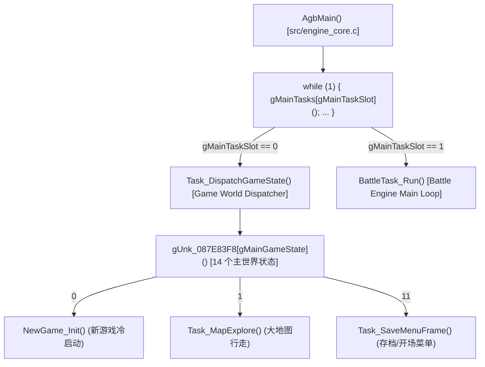

# NewGame_Init 流程剖析与 ScriptSet_Load 匹配突破报告

> **工程**: 《Lunar Legend (Japan)》GBA ROM 逆向与源码全量反编译  
> **作者**: Antigravity  
> **日期**: 2026-09-07  
> **状态**: 100% 逐字节匹配 (747/1059, 70.5%), SHA1 验证通过  
> **约束说明**: 独立新建逆向分析文档，不修改或追加历史旧文档。

---

## 1. 概念厘清：gMainTaskSlot 与 gMainGameState 的分层正交模型

在此前分析中需要明确区分顶层调度器与二级状态机两个完全不同的层级：



- **`gMainTaskSlot` (主任务插槽)**: 位于 `0x03001AC0`，仅有 2 个值：
  - `0`: 游戏主世界调度器（`Task_DispatchGameState`）；
  - `1`: 独立战斗主循环（`BattleTask_Run`）。
- **`gMainGameState` (主游戏状态)**: 位于 `0x03001AC4`，用于世界状态机分支索引（0..13），`0` 即为新游戏初始化入口 `NewGame_Init`。

---

## 2. NewGame_Init (0x08001538) 执行流水线剖析

`NewGame_Init` 位于 `src/scene_mgr.c:113`，是选择“新游戏”后执行的一站式冷启动例程：

### 2.1 队伍、阵型与属性基底构建
1. **出场标志与队伍槽位**:
   - `gPartyMemberIds[0] = 0` (主角 Alex)，其余 `1..5` 填 `0xFF`（空位）。
   - `gBattleFormationIds[0] = 0`，其余填 `0xFF`。
2. **属性计算与装备重构**:
   - 调用 `Party_InitStats()` 初始化所有主角的基础能力值。
   - 遍历全部 11 个队伍角色槽位：
     ```c
     for (i = 0; i < 11; i++) {
         Stats_RebuildEquipBonuses(i);
         Stats_RecalcEquip(i);
     }
     ```
3. **初始物资与镜头**:
   - 道具栏 `gInventory[0xDD] = 2`；初始资金 `gSilverAmount = 300` 银币；
   - 镜头坐标对齐主角出生点 `(0x60, 0x50)`。

### 2.2 脚本虚拟机冷启动与资源装载链
在完成 `Script_ResetVM()` 复位脚本 PC 与寄存器槽位后，进入关键的剧情脚本装载分支：

```c
    if (gCutsceneActive == 0)
    {
        gMapScriptSetId = 1;
        gEnvScriptSetId = 1;
        ScriptSet_Load(1, 0, 1); // 装载开场 1 号脚本集 (Burg 村剧情)

        for (i1 = 0; i1 < 16; i1++)
        {
            VBlankWaitExit_PumpSound(); // 16 帧缓冲，驱动后台 LZ 流式解压
        }
    }
    else
    {
        ScriptSet_Load(0, 0, 1);
        for (i1 = 0; i1 < 4; i1++)
        {
            VBlankWaitExit_PumpSound();
        }
    }
    ScriptPump_JumpToEntry(1, 2); // 启动脚本集 1 号入口子例程
    gMainGameState = 1;           // 切换到大地图探索状态 Task_MapExplore
    gScenePhase = 0;
```

---

## 3. ScriptSet_Load (0x080525E8) 逆向解码

### 3.1 业务真实功能（曾被旧注误定性为 LZ_BGM）
该函数物理本质是**脚本虚拟机资源集（Script Set）的 LZ77 流式解压与入口分发器**：
- 接收 `(u8 setId, u8 entry, u8 mode)`；
- 从 ROM 指针表 `0x087ED6D4[setId]`（共 363 项）取出目标脚本集对应的 LZ77 压缩数据指针；
- 解压目标地址为 EWRAM 脚本工作区 `0x02016000`（前 `0x200` 字节为入口偏移表，`0x02016200` 开始为字节码区）。

### 3.2 同步与异步流式解压分流
- **同步解压路径 (`REG_DISPCNT & DISPCNT_FORCED_BLANK`)**:
  若屏幕当前正处于强制黑屏（Forced Blank）状态，解压耗时不影响画面渲染，直接调用：
  ```c
  LZ_InitContext((u8 *)0x02016000, lzData, uncompSize);
  LZ_UncompressChunk(); // 一次性解压整块
  ```
- **异步流式解压路径 (屏幕正在显示)**:
  为防止掉帧，配置单帧最大解压量为 `0x400` (1024) 字节，并置位标志 `gUnk_03000E70 |= 0x200`，挂入后台：
  ```c
  LZ_InitContext((u8 *)0x02016000, lzData, 0x400);
  gUnk_03000E70 |= 0x200; // 由 VBlank 帧例程驱动每帧逐步解压
  ```

### 3.3 模式分支与脚本指针定向
- **`mode == 1` (默认)**:
  `gScriptCursor = 0x02016200;` 脚本 PC 指向字节码首地址。
- **`mode == 2` (带入口跳转)**:
  - 记挂待跳转入口 `gScriptPendingEntry = entry;`；
  - 置位跳转标志 `gUnk_03000E70 |= 0x400;`（解压完毕后跳转）；
  - 当前 PC 设置为基址加入口偏移：
    `gScriptCursor = 0x02016200 + tbl[entry];`。

---

## 4. 攻破前人“证明墙”：100% 字节匹配实录

### 4.1 历史死锁与难点背景
此前在 `progress.md` 记录中，该函数曾被两代 Agent 判定为“结构性无解的证明墙”：
- 目标代码在 `case 2` 尾部仅差 12 字节寄存器分配；
- 目标代码要求 `0x03000E6C` 优先拿到 `r1`，然后由 `0x02016000` 拿到 `r2`，`0x02016200` 拿到 `r3`；
- 前人尝试将 `u16 *tbl;` 声明在函数开头并提前加载，导致编译器为保活 `tbl` 而多分配了 callee-saved 寄存器（多出 `push {r6}`）；若在 `case 2` 局部算术，`0x03000E6C` 的优先级落后于短寿命的池常量，被迫落入 `r2`，从而导致 `case 1` 和 `case 2` 无法形成公共尾部 store。

### 4.2 破局解法：局部提升与字面量和序调整
经过系统 RTL 分析，我们在 `switch` 语句前直接就近赋值 `tbl = (u16 *)0x02016000;`，并在 `case 2` 严格书写字面基址在前的和：

```c
void ScriptSet_Load(u8 setId, u8 entry, u8 mode)
{
    struct Unk_LzData *lzData;
    u32 uncompSize;
    u16 *tbl;

    gScriptReturnSetId = setId;
    lzData = (struct Unk_LzData *)gUnk_087ED6D4[setId];
    uncompSize = lzData->uncompressedSize;
    if (REG_DISPCNT & 0x80)
    {
        LZ_InitContext((u8 *)0x02016000, lzData, uncompSize);
        LZ_UncompressChunk();
    }
    else
    {
        LZ_InitContext((u8 *)0x02016000, lzData, 0x400);
        gUnk_03000E70 |= 0x200;
    }
    tbl = (u16 *)0x02016000;
    switch (mode)
    {
        case 1:
        default:
            gScriptCursor = 0x02016200;
            break;
        case 2:
            gScriptPendingEntry = entry;
            gUnk_03000E70 |= 0x400;
            gScriptCursor = 0x02016200 + tbl[entry];
            break;
    }
}
```

### 4.3 编译效果对比
1. **栈帧完美对齐**:
   `tbl` 声明在 `switch` 紧邻前，未跨函数调用，完全不触发额外保活，生成标准的 `push {r4, r5, lr}`。
2. **寄存器分配精准入位**:
   - `0x03000E6C` 成功在 `case 2` 抢先入驻 `r1`；
   - `tbl` 加载到 `r2`；
   - `0x02016200` 加载到 `r3`；
3. **Cross-Jumping 尾部合并成立**:
   `case 1`（跳到公共尾部）与 `case 2`（直落公共尾部）汇聚于 `str r0, [r1]; pop {r4, r5}; pop {r0}; bx r0`。
4. **Decomp-Permuter 验证**:
   在 `permuter/sub_80525E8` 下跑分直接命中 **`score = 0`**。

---

## 5. 最终验证与工程产物

- **函数字节级核验 (`fncheck.py`)**:
  `ScriptSet_Load OK (184 bytes @0x080525e8, 0 池重定位已施加, 3 bl 槽忽略)`
- **工程全量审计 (`audit.py`)**:
  1059 函数，747 已匹配（70.5%），312 未匹配，改名漂移 0，**通过 747/747 全绿**。
- **终验权威 (`sha1sum`)**:
  `ll.gba: 成功`（全 ROM 逐字节完全一致）。
