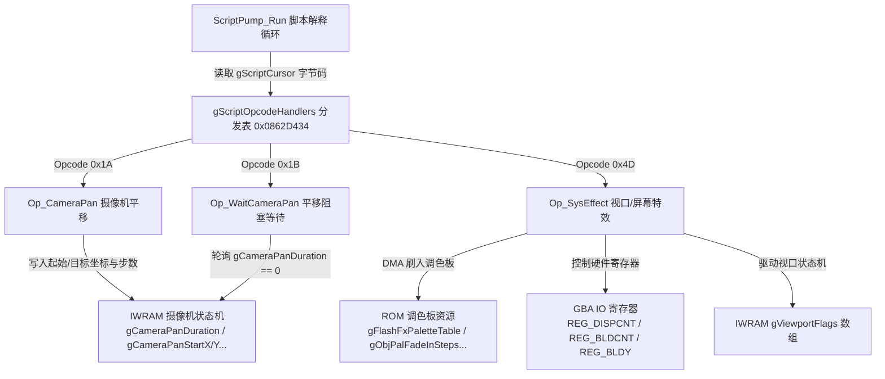

# 《Lunar Legend》脚本虚拟机核心算子与 ROM 数据区系统化逆向攻关手册

> **作者**: Antigravity (gpnux)  
> **建立日期**: 2026-09-07  
> **涉及核心代码**: `src/code_804F0B8.c` (`Op_SysEffect`, `Op_CameraPan`, `Op_WaitCameraPan`, `ScriptPump_Run`)  
> **涉及核心数据**: `src/data_805769C.c`, `include/data_805769C.h`, `include/iwram.h`, `linker.ld`, `scripts/data.json`  
> **终验状态**: `make` 成功，`sha1sum -c ll.sha1` 100% 逐字节完全匹配 (746/1059, 70.4%)，`audit.py` 全量通过

---

## 1. 攻关全景与系统架构

在《Lunar Legend (Japan)》GBA 反编译工程中，`src/code_804F0B8.c` 承载了**剧情事件脚本虚拟机 (Script VM)** 的核心解释循环以及最关键的一批系统操作码（Opcode Handlers）。

本阶段攻关聚焦于以下三大系统性突破：
1. **动态与静态深度融合逆向**: 基于游戏实际运行内存镜像 (`memory.dump.dmp`)，完整重构了全工程体量最大、逻辑最复杂的视口特效算子 `Op_SysEffect` (Opcode 0x4D, 1264 字节) 的全流程执行链与子状态机。
2. **摄像机平移与等待链路闭环**: 彻底攻克 `Op_CameraPan` (Opcode 0x1A, 284 字节) 的逐字节匹配，结合其消费端与等待端 `Op_WaitCameraPan` (Opcode 0x1B, 28 字节) 完成全链语义化重构与精准改名。
3. **ROM 数据区系统性去 Blob 化与语义命名**: 彻底打破原有不透明的 6.5MB 数据 blob，对 `0x0808B814..0x080BAF54` 等关键数据段完成细粒度物理拆分、结构定性、消费端关联与语义符号命名。



---

## 2. Script VM 模块物理边界判定与命名规范体系

### 2.1 模块物理边界判定与解耦规划

当前工程中 `src/code_804F0B8.c`（包含 102 个函数）的划分存在历史局限，将三个完全不同的子系统混合在同一文件中。经过全 ROM 物理地址与调用图深度逆向，确立了以下精确的模块边界：

```text
+----------------------+ 0x0804F0B8
| Object Pool 辅助函数   |  3 个函数 (sub_804F0B8, sub_804F10C, sub_804F17C)
| (属于 Entity/Sprite) |  操作 GetObjPool(), 匹配 sub_80489E8 槽位
+----------------------+ 0x0804F210
| SIO 对战通信状态机    |  3 个函数 (SioBattle_ResetState, SioBattle_GetState, SioBattle_ClearSlots)
| (属于 Link Cable)    |  操作 gUnk_03000DF0 / gUnk_03000E08 对战通信槽
+======================+ 0x0804F280  <=== 【Script VM 真实物理模块起始】
|                      |  
| 剧情事件脚本虚拟机    |  包含 80 项 Opcode 处理器 (起始于 0x0804F280 Op_CharaControl)
| (Script VM Core)     |  包含主解释器循环 ScriptPump_Run (0x08050014)
|                      |  包含图块 DMA 流引擎 FlushTileDma (0x080527AC)
| 跨度 16,752 字节     |  包含 VM 重置与中断恢复 Script_ResetVM / Script_Abort
|                      |  包含全部 Opcode 分派函数至 0x080533D4 Op_SetCharacterLevel
|                      |  
+======================+ 0x080533EE  <=== 【Script VM 真实物理模块结束】
+----------------------+ 0x080533F0
| Sound 音频主驱动引擎  |  SoundMain_Frame 起始 (sound 翻译单元)
+----------------------+
```

- **真实边界结论**: Script VM 的纯净物理边界为 **`0x0804F280` 至 `0x080533EE`**。
- **解耦重构落地 (已完成)**:
  1. `src/code_804F0B8.c` (`0x0804F0B8..0x0804F20F`, 3 个对象池/类型检测辅助函数, 3/3 100% 匹配)。
  2. `src/sio_battle.c` (`0x0804F210..0x0804F27F`, 3 个联机通信对战槽管理函数, 3/3 100% 匹配)。
  3. `src/script_vm.c` (`0x0804F280..0x080533EE`, 96 个核心脚本虚拟机与算子函数, 86/96 匹配, 剩余 10 个未匹配)。
  - `linker.ld` 同步顺序链接 `code_804F0B8.o(.text)` $\to$ `sio_battle.o(.text)` $\to$ `script_vm.o(.text)`。
  - `functions.tsv` 与 `reports/remaining.md` 已全面重推导刷新，ROM 逐字节 100% 匹配绿。

---

### 2.2 算子形参与局部变量统一规范

为终结不同开发者引入的 `ptr`、`arg0`、`data`、`p` 等杂乱命名，Script VM 算子（Opcode Handlers）确立了统一的编码规范契约：

1. **形参命名统一**:
   - 统一使用 `u32 *pScriptCursor`（指向 32 位全局脚本 PC `gScriptCursor`）。
   - 严禁使用无意义的 `ptr`、`arg0` 或错误的上下文结构体指针。
2. **字节码指令流指针统一**:
   - 统一使用 `u8 *pBytecode = (u8 *)*pScriptCursor;`（或多阶段复合特效算子中的 `u8 *insn`）。
   - 禁止混用 `data`、`p`、`rec` 等不具备语义的缩写。
3. **标准算子契约模型**:
   ```c
   u32 Op_Example(u32 *pScriptCursor)
   {
       u8 *pBytecode = (u8 *)*pScriptCursor;
       u8 operand1 = pBytecode[1];
       u16 operand2 = pBytecode[2] | (pBytecode[3] << 8);

       // 算子具体业务逻辑...

       // 推进 PC 并返回执行状态:
       *pScriptCursor += INSN_LEN;
       return 1; // 1 = 本帧继续解释执行下一条指令; 0 = 让出当前帧 (等待异步事件/VBlank)
   }
   ```
4. **落地现状**:
   `src/code_804F0B8.c` 中所有已匹配的 74 个 Opcode 处理函数已全量按此规范重构统一，并全部通过 `scripts/fncheck.py` 逐字节验证。

---

## 3. 动态内存镜像现场还原 (`memory.dump.dmp`)

针对用户在游戏中触发 `sub_804FB24` (`Op_SysEffect`) 时 dump 的 256MB 物理内存镜像进行了总线级别的映射与上下文逆向：

### 2.1 现场寄存器与指针解析
- **断点地址**: `0x0804FB24` (`PUSH {R4-R6,LR}`)
- **传入参数**: `r0 = 0x03000E6C` (`&gScriptCursor`)
- **内存寻址结构**: GBA 线性总线直接映射，内存 dump 偏移即物理地址。
- **读取 `0x03000E6C` 处指针**: 值存放为 `0x02016EB2`，位于 EWRAM 动态解压脚本缓冲区中。

### 2.2 运行时字节码实况剖析
在 dump 文件偏移 `0x02016EB2` 提取的真实指令字节流如下：
```text
Offset 0x02016EB2:  4D 64 00 37 30 0C 00 ...
```
- **Byte 0 (`0x4D`)**: Opcode `0x4D`，即进入 `Op_SysEffect`。
- **Byte 1 (`0x64`)**: 子操作码 `0x64` (`SYSFX_BGM_RESUME`)。
- **Byte 2 (`0x00`)**: 参数 `0x00`。
  - 由于参数为 `0`，走入 `else`（复位族/结束族）分支。
  - `case 0x64` 分支执行：`Bgm_Continue()`，恢复当前场景背景音乐播放。
  - 随后执行 `*pScriptCursor += 3`，脚本 PC 推进 3 字节至 `0x02016EB5`，函数返回 1 指示解释器继续执行后续脚本。

---

## 4. `Op_SysEffect` (Opcode 0x4D) 全流程逆向与硬件交互

`Op_SysEffect` (`0x0804FB24`, 1264 字节, 473 条 Thumb 指令) 是全游戏最核心的特效控制器，其顶层设计呈现严谨的“参数执行族 (`insn[2] != 0`)”与“复位收尾族 (`insn[2] == 0`)”对立架构。

### 3.1 完整子操作码语义矩阵

| SubOp | 符号常量 | `insn[2] != 0` (执行 / 推进) | `insn[2] == 0` (复位 / 关闭) | 涉及硬件 / 资源 |
|---|---|---|---|---|
| `0x00` | `SYSFX_SHAKE` | 设置视口抖动掩码 (`gViewportFlags[4]`)，开启使能位 (`gViewportFlags[0] |= 3`) | 清除抖动使能位 (`gViewportFlags[0] &= ~3`) | 视口滚动渲染 |
| `0x01` | `SYSFX_FLASH` | 使能白闪标志 (`gViewportFlags[0] |= 4`) | 清除白闪标志，关闭 DISPCNT 对应位 | `REG_DISPCNT` |
| `0x02` | `SYSFX_BGLAYER` | 根据 `gCurrentMapId == 0x63` 开启 BG2 (`0x0400`) 或 BG3 (`0x0800`) | 关闭对应 BG 图层位 | `REG_DISPCNT` 图层控制 |
| `0x03` | `SYSFX_CAMEASE` | 开启摄像机平滑插值缓动 (`gDrawCamEaseActive = 1`) | 关闭平滑缓动 (`gDrawCamEaseActive = 0`) | 相机插值引擎 |
| `0x04` | `SYSFX_PALFX_SEQ` | 复合调色板渐变序列机 (子命令 1..5: 黑淡入/白闪配置/清空BG调色板/双相淡入/长淡入) | 复位调色板相位与计数 (`gViewportFlags[14..15] = 0`) | `gBlendControl`, `gBlendCoefficients`, DMA3 |
| `0x05` | `SYSFX_SAVE_OPEN` | 驱动存档状态机 `Save_Fsm(1)`，未完成时返回 0 阻塞 | 置位标志并调用 `SaveUi_OpenLoad()` 开启读档 UI | 存档系统 |
| `0x06` | `SYSFX_WAIT_A` | *(无执行态)* | 轮询等待玩家按下 A 键，触发 `Script_Abort` 并软复位到 Logo | 系统复位 |
| `0x07` | `SYSFX_OBJPAL_IN` | 10 帧逐帧渐显：前 9 帧 DMA 刷入 OBJ 调色板 0..9，第 10 帧刷入末帧 bank 10 | 复位渐显帧计数 (`gViewportFlags[15] = 0`) | `gObjPalFadeInSteps`, `gObjPalFadeInFinal` |
| `0x08` | `SYSFX_SAVEUI_PAL`| *(无执行态)* | 存档 UI OBJ 调色板 4 阶段分步装载状态机 | 菜单实体描述符解析 |
| `0x4D` | `SYSFX_HEAL` | 指定角色完全回复：`FullHealCharacter(insn[2])` | 指定角色完全回复：`FullHealCharacter(0)` | 队伍角色状态属性 |
| `0x64` | `SYSFX_BGM_RESUME`| *(无执行态)* | 恢复背景音乐播放：`Bgm_Continue()` | 音效驱动引擎 |
| `0xC8` | `SYSFX_MAPBG` | 全量背景地图装载：`MapBg_LoadFull(insn[2] + 0x81)` | 使能 BG0 显示 (`REG_DISPCNT |= 0x0100`) | 地图 BG 系统 |
| `0xC9` | `SYSFX_INTROBG` | 加载特定开场背景：`IntroBg_Load(insn[2])` | 加载默认开场背景：`IntroBg_Load(0)` | 开场背景图块系统 |
| `0xCA` | `SYSFX_WHITEOUT` | 白化淡入 (`insn[2]==1`) 或白化淡出 (`insn[2]!=1`) 步进机 | 复位白化帧计数器 (`gViewportFlags[10] = 0`) | `REG_BLDCNT`, `REG_BLDY` |

### 3.2 硬件 IO 与 DMA 规范化落地
所有裸硬件地址均已清除，严格遵循 [`docs/RULES_HARDWARE_IO.md`](file:///home/gpnux/decomp/ll/docs/RULES_HARDWARE_IO.md)：
1. **显示控制寄存器**: `REG_DISPCNT |= 0x0400;` / `REG_DISPCNT &= 0xFDFF;` 替代裸指针 `*((vu16 *)0x04000000)`。
2. **混色控制**: `gBlendControl` 与 `gBlendCoefficients` 分别映射 GBA 硬件 `BLDCNT` (`0x04000050`) 与 `BLDY` (`0x04000054`)。
3. **DMA3 传输**: 使用 `DmaCopy16(3, src, dst, size)` 替代手工展开的 `vu32 *dmaRegs`，内联实现中保留硬件空读 `dmaRegs[2];`，完美复现 GBA 内存总线同步与编译字节。

---

## 5. `Op_CameraPan` 与 `Op_WaitCameraPan` 摄像机平移系统

### 4.1 协议格式与平移启动 (`Op_CameraPan`, `0x0804F64C`)
- **指令长度**: 6 字节
- **格式**: `1A [duration:1] [targetX_lo:1] [targetX_hi:1] [targetY_lo:1] [targetY_hi:1]`
- **执行逻辑**:
  1. 记录平移总帧数 `gCameraPanDuration = pBytecode[1]`，并将平移步数归零 `gCameraPanStep = 0`。
  2. 依据当前摄像机绘制模式 `gCameraDrawMode` (case 2/5/8/default)，从视口或世界坐标采样作为起点：
     - `case 2`: 起点 X 取 `gDrawCamX`，起点 Y 取 `0`。
     - `case 5`: 起点 X 依据缓动状态取 `gDrawCamX` 或 `gCameraPosX`，起点 Y 取 `gCameraPosY`。
     - `case 8`: 起点 Y 依据缓动状态取 `gDrawCamY` 或 `gCameraPosY`，起点 X 取 `gCameraPosX`。
     - `default`: 起点直接取 `gCameraPosX` 与 `gCameraPosY`。
  3. 合成 16 位目标世界坐标：
     - `gCameraPanTargetX = pBytecode[2] + (pBytecode[3] << 8);`
     - `gCameraPanTargetY = pBytecode[4] + (pBytecode[5] << 8);`
  4. `*pScriptCursor += 6; return 1;`

### 4.2 逐字节匹配关键攻坚
- **条件跳转形状修正**: 原草稿 `if (gDrawCamEaseActive)` 生成了 `beq`，反转条件写为 `if (!gDrawCamEaseActive)` 精准生成了目标汇编中的 `bne` 指令。
- **16 位数值合成算术操作符**: 使用加法 `+` 精准生成 `adds` 指令；若使用位或 `|` 则会生成 `orrs` 指令导致字节偏差。

### 4.3 阻塞等待与全链改名 (`Op_WaitCameraPan`, `0x08052E80`)
- **历史问题**: 该函数在早期版本中被误命名为 `Op_WaitCameraSnap`。
- **真实逻辑**:
  ```c
  u32 Op_WaitCameraPan(u32 *pScriptCursor)
  {
      if (gCameraPanDuration != 0)
      {
          return 0; // 平移尚未结束，返回 0 挂起脚本 VM，保持当前 PC 不变
      }
      (*pScriptCursor)++;
      return 1; // 平移结束，推进 1 字节并继续执行下一条指令
  }
  ```
- **全链改名**: 通过 `scripts/rename_fn.sh` 完成跨 `ll.cfg`, `code.s`, `include/code_0.h`, `functions.tsv`, `src/code_804F0B8.c` 的全自动重命名，SHA1 绿。

---

## 6. Script VM 80 项 Opcode 全部分发表 (`0x0862D434`)

在 `src/code_804F0B8.c` 的解释器主循环 `ScriptPump_Run` 中，解释器通过位于 ROM `0x0862D434` 的函数指针表 `gScriptOpcodeHandlers` 进行单字节分发：
```c
while (gScriptOpcodeHandlers[*(u8 *)gScriptCursor](&gScriptCursor) == 1) { }
```

下表完整列出 80 项处理函数的物理地址、当前命名与功能域：

| Opcode | 物理入口 | 函数名称 | 状态 | 功能分类与简要说明 |
|---|---|---|:---:|---|
| `0x00` | `0x08050720` | `sub_8050720` (`Op_DialogMessage`) | ⏸ | 对话脚本分支控制与消息分派 |
| `0x01` | `0x08052858` | `Op_ScriptJump` | ✅ | 无条件跳转至脚本区指定 entry (查 `gUnk_02016000` 表) |
| `0x02` | `0x08052878` | `Script_Call` | ✅ | 脚本子例程调用（压栈返回地址至 `gUnk_03000E80`） |
| `0x03` | `0x080511A0` | `Op_ScriptReturn` | ✅ | 脚本子例程返回（出栈返回地址，若栈空则关闭 VM 并恢复 BGM） |
| `0x04` | `0x0804F280` | `sub_804F280` (`Op_CharaControl`) | ⏸ | 实体移动/动作指令流分派状态机 |
| `0x05` | `0x080528C4` | `Op_Nop` | ✅ | 空操作占位符 (NOP 空函数，仅 `bx lr`) |
| `0x06` | `0x08051230` | `Op_ScriptStop` | ✅ | 脚本终止，释放 VM 活动标志 |
| `0x07` | `0x08052B80` | `Op_WaitCharsStop` | ✅ | 等待所有角色动作步进停止 (`Chara_AnyMoving() == 0`) |
| `0x08` | `0x08052BA0` | `Op_LoadCharaGfx` | ✅ | 加载指定角色的精灵图块资源 |
| `0x09` | `0x08052BE0` | `Op_LoadCharaPal` | ✅ | 加载指定角色的 OBJ 调色板 |
| `0x0A` | `0x08052C04` | `Op_WaitSpriteLoad` | ✅ | 等待精灵资源 DMA 装载完毕 (`GetPendingSpriteLoad() == 0`) |
| `0x0B` | `0x08052C24` | `Op_SceneChangeFade`| ✅ | 带淡入淡出的地图场景切换 |
| `0x0C` | `0x08052C90` | `Op_SceneChangePlain`| ✅ | 无渐变的瞬时地图场景切换 |
| `0x0D` | `0x08052CD0` | `Op_WaitSceneIdle` | ✅ | 等待场景切换和过渡状态机空闲 (`gSceneSubState == 0`) |
| `0x0E` | `0x08052CF0` | `Op_LoadMap` | ✅ | 加载地图数据与瓦片集 |
| `0x0F` | `0x08052D4C` | `Op_IfEventFlagJump` | ✅ | 事件标志测试条件跳转 (`EventFlags_Test`) |
| `0x10` | `0x08052D8C` | `Op_SetEventFlag` | ✅ | 置位事件标志 (`EventFlags_Set`) |
| `0x11` | `0x08052DAC` | `Op_ClearEventFlag` | ✅ | 清除事件标志 (`EventFlags_Reset`) |
| `0x12` | `0x08052DCC` | `Op_IfSwitchJump` | ✅ | 场景局部开关测试条件跳转 (`SwitchFlags_Test`) |
| `0x13` | `0x08052E0C` | `Op_SetSwitch` | ✅ | 置位场景局部开关 (`SwitchFlags_Set`) |
| `0x14` | `0x08052E2C` | `Op_ClearSwitch` | ✅ | 清除场景局部开关 (`SwitchFlags_Reset`) |
| `0x15` | `0x080512C4` | `sub_80512C4` (`Op_ScriptStreamLZ`) | ⏸ | 脚本数据流 LZ 动态解压上下文驱动 |
| `0x16` | `0x080513A0` | `sub_80513A0` (`Op_ScriptReturnChunk`) | ⏸ | 脚本块解压返回处理 |
| `0x17` | `0x0805144C` | `sub_805144C` (`Op_DialogText`) | ⏸ | 剧情对话文字流排版与视口滚动同步 |
| `0x18` | `0x08052E4C` | `Op_CameraSnap` | ✅ | 摄像机强行吸附锁定目标 (`gCameraSnapFlag = 1`) |
| `0x19` | `0x08052E6C` | `Op_CameraFollow` | ✅ | 摄像机自由跟随玩家 (`gCameraSnapFlag = 0`) |
| `0x1A` | `0x0804F64C` | `Op_CameraPan` | ✅ | 摄像机平移插值启动 (`gCameraPanDuration/TargetX/Y`) |
| `0x1B` | `0x08052E80` | `Op_WaitCameraPan` | ✅ | 轮询等待摄像机平移完成 (`gCameraPanDuration == 0`) |
| `0x1C` | `0x0804F768` | `Op_RemovePartyMember` | ✅ | 队伍角色移出 (清除队伍与战斗阵型槽位) |
| `0x1D` | `0x0804F7F8` | `Op_AddPartyMember` | ✅ | 队伍角色加入 (升序插入槽位并重置状态) |
| `0x1E` | `0x08052E9C` | `Op_LoadCutsceneAnim`| ✅ | 加载过场特写动画 |
| `0x1F` | `0x08052EC0` | `Op_RestartCharaAnim`| ✅ | 重置角色动作动画帧与精灵节点 |
| `0x20` | `0x08052F20` | `Op_WaitCharaAnim` | ✅ | 等待角色指定动作动画播放完成 |
| `0x21` | `0x08052F44` | `Op_IfPartyMemberJump` | ✅ | 队伍指定成员数量判断条件跳转 |
| `0x22` | `0x0804F8D8` | `Op_ScriptBattle` | ✅ | 剧情触发脚本对战启动与战后计数器分派 |
| `0x23` | `0x080528C8` | `Op_DialogSetup` | ✅ | 打开对话框并初始化排版器 |
| `0x24` | `0x08051A1C` | `Op_OpenWindow` | ✅ | 弹出通用 UI 窗口 (配置 BG0 与 DMA 清理) |
| `0x25` | `0x0805291C` | `Op_CloseWindow` | ✅ | 关闭当前活动 UI 窗口 (DMA 清理与图层隐藏) |
| `0x26` | `0x080529B8` | `Op_WaitFrames` | ✅ | 脚本帧计数阻塞等待 (`gUnk_03000E74`) |
| `0x27` | `0x08052FAC` | `Op_LoadAnimSet` | ✅ | 加载动画模型集 |
| `0x28` | `0x08052FC8` | `Op_AnimSlotResume` | ✅ | 恢复动画槽位播放 |
| `0x29` | `0x08052FE4` | `Op_AnimSlotPause` | ✅ | 暂停动画槽位播放 |
| `0x2A` | `0x08053000` | `Op_WaitAnimSlotIdle` | ✅ | 等待动画槽位播放完成 |
| `0x2B` | `0x08053024` | `Op_MenuLoadAnims` | ✅ | 菜单系统专用动画加载 |
| `0x2C` | `0x08053040` | `Op_MenuUnlock` | ✅ | 允许玩家呼出主菜单 (`MenuEnt_Unlock`) |
| `0x2D` | `0x0805305C` | `Op_MenuLock` | ✅ | 禁止玩家呼出主菜单 (`MenuEnt_Lock`) |
| `0x2E` | `0x08053078` | `Op_WaitMenuReady` | ✅ | 等待菜单完全关闭与界面就绪 |
| `0x2F` | `0x0805309C` | `Op_FullHealParty` | ✅ | 全体队伍 HP/MP/异常状态全满回复 |
| `0x30` | `0x080530B4` | `Op_EquipItem` | ✅ | 给指定角色装配道具/装备 |
| `0x31` | `0x080530D4` | `Op_GiveTakeItem` | ✅ | 获得或失去指定数量道具 |
| `0x32` | `0x08053104` | `Op_SilverAddSub` | ✅ | 获得或扣除银两 (游戏内货币) |
| `0x33` | `0x08051BE4` | `sub_8051BE4` (`Op_DialogChoice`) | ⏸ | 商店购物交易或对话二选一交互窗口驱动 |
| `0x34` | `0x08052A14` | `Op_BgmPlay` | ✅ | 播放指定 ID 背景音乐 |
| `0x35` | `0x08052A38` | `Op_BgmStop` | ✅ | 停止当前背景音乐 |
| `0x36` | `0x08052A50` | `Op_BgmVolume` | ✅ | 设置背景音乐主音量 |
| `0x37` | `0x08052A70` | `Op_BgmFadeIn` | ✅ | 背景音乐淡入 |
| `0x38` | `0x08052A8C` | `Op_BgmFadeOut` | ✅ | 背景音乐淡出 |
| `0x39` | `0x08052AA8` | `Op_SfxPlay` | ✅ | 触发音效播放 |
| `0x3A` | `0x08052ACC` | `Op_SfxStop` | ✅ | 停止指定音轨音效 |
| `0x3B` | `0x08053138` | `Op_IfItemQtyJump` | ✅ | 检查背包中道具持有数量条件跳转 |
| `0x3C` | `0x0805316C` | `Op_ChestOpen` | ✅ | 宝箱开启标记与拾取逻辑 |
| `0x3D` | `0x0805318C` | `Op_SaveUiTrigger` | ✅ | 触发游戏存档确认界面 |
| `0x3E` | `0x080531A8` | `Op_IfSaveLoadedJump`| ✅ | 检查是否为读档继续进行条件跳转 |
| `0x3F` | `0x080531E4` | `Op_SaveTimerA` | ✅ | 游戏计时器 A 自增推进 |
| `0x40` | `0x08053200` | `Op_SaveTimerB` | ✅ | 游戏计时器 B 倒计时自减 |
| `0x41` | `0x0805321C` | `Op_IfSaveFlagJump` | ✅ | 存档计时器标志测试条件跳转 |
| `0x42` | `0x08053254` | `Op_SaveOp` | ✅ | 存档标志置位操作 |
| `0x43` | `0x08053270` | `Op_SetFlagsList` | ✅ | 批量置位标志位列表 (支持 Event/Switch) |
| `0x44` | `0x080532DC` | `Op_ClearFlagsList` | ✅ | 批量清除标志位列表 (支持 Event/Switch) |
| `0x45` | `0x0804F974` | `Op_IfAllFlagsJump` | ✅ | 标志位列表全为真时跳转 |
| `0x46` | `0x0804FA04` | `Op_IfAllFlagsClearJump`| ✅ | 标志位列表全为假时跳转 |
| `0x47` | `0x0804FA94` | `Op_IfAnyFlagJump` | ✅ | 标志位列表任一为真时跳转 |
| `0x48` | `0x08053348` | `Op_ClearSwitchTail`| ✅ | 局部开关组范围清空 |
| `0x49` | `0x08053360` | `Op_IfMoneyJump` | ✅ | 银两持有数量阈值判断条件跳转 |
| `0x4A` | `0x080533A0` | `Op_StartLogoFade` | ✅ | 触发 Logo 界面渐显特效 |
| `0x4B` | `0x080533B4` | `Op_WaitLogoFade` | ✅ | 等待 Logo 界面特效结束 |
| `0x4C` | `0x080533D4` | `Op_SetCharacterLevel`| ✅ | 强制设置角色等级属性 (`sub_800A3C8`) |
| `0x4D` | `0x0804FB24` | `Op_SysEffect` | ✅ | 系统/视口万能高级综合特效 (震屏/渐显/白闪) |
| `0x4E` | `0x08052AE8` | `Op_RandomJump` | ✅ | 脚本随机分支跳转 (区间 LCG 伪随机数查表) |
| `0x4F` | `0x08052B34` | `Op_ScriptCallAlt` | ✅ | 脚本子例程调用变体 (含跳转表寻址) |

---

## 7. ROM 数据区系统性去 Blob 化与语义定性

ROM 数据区占据了整张 GBA 游戏 95.7% 的空间（8.03MB）。为了将巨大的无符号 `.incbin` 转化为强类型、高可读性且能在 C 代码中直接符号重定位的结构，对 `0x0808B814..0x080BAF54` 等核心数据区建立了语义化映射规范。

### 6.1 核心数据段结构定性详解

#### 1. 地图 NPC 槽组表 (`gMapNpcSlotGroups`, `0x08091948`)
- **大小**: 2216 字节
- **消费端**: `Sprites_LoadMapNPCs` (`0x080033E8`), `MapScene_LoadNpcSlotIds`
- **结构模型**: `gMapSceneDescriptors[mapId].npcSlotGroupId` 索引本表。每一项包含当前地图需实例化的 NPC 数量以及对应的资源配置 ID 列表。

#### 2. 职业属性成长曲线索引表 (`gClassStatCurveTable`, `0x080921F0`)
- **大小**: 88 字节 (9 职业 × 8 维属性 = 72 字节 + 16 字节边界配置)
- **消费端**: `sub_8009F70` (角色升级数值推导)
- **结构模型**: 矩阵 `u8 curves[classId][statIdx]`，用于寻址该职业升级时在特定属性上采用的曲线算法 ID。

#### 3. 升级所需经验值表 (`gLevelUpExpTable`, `0x08092248`)
- **大小**: 400 字节 = 100 级 × 4 字节 (`u32[100]`)
- **消费端**: `src/code_8005020.c`
- **结构模型**: 1 到 100 级每级所需的经验值累积阈值。升级计算函数通过 `value -= gLevelUpExpTable[i]` 遍历计算角色当前等级。

#### 4. 属性成长曲线分段步进表 (`gStatGrowthCurveTables`, `0x080923D8`)
- **大小**: 4100 字节 = 41 组曲线 × 100 字节
- **消费端**: `src/code_8005020.c`
- **结构模型**: 每一组曲线含 100 字节，记录对应等级下属性数值的增加量，由 `gClassStatCurveTable` 选出的曲线 ID 进行跨步累加。

#### 5. 技能与法术习得定义表 (`gSkillLearnTable`, `0x08093418`)
- **大小**: 648 字节 (由 312 字节主体 + 336 字节扩充组成，共 62 项 × 5 字节)
- **消费端**: `Stats_BuildSkillList`, `code_8044394.c`
- **结构模型**: 结构体 `{ u8 lvLimit, u8 groupAndFlags, u8 f2, u8 f3, u8 skillId }`。当角色达到等级门槛且魔法系别匹配时，将自动习得该技能。

#### 6. 主游戏文本池 (`gMsgPoolMain`, `0x080936A0`)
- **大小**: 6536 字节
- **消费端**: `src/code_8010F10.c` 文本跳转与显示引擎
- **结构模型**: 变长字符串池，各消息字符串由 `0xFF` 字节结尾分隔。代码在开机或进入场景时扫描该池构建快速跳转指针表。

#### 7. 道具与角色名称定长表
- **`gItemNames` (`0x08095028`)**: 2048 字节 = 256 项 × 8 字符 (`const u8[][8]`)。覆盖全游戏武器、防具、道具名。
- **`gCharacterNames` (`0x08095828`)**: 500 字节 = 62 项左右 × 8 字符 (`const u8[][8]`)，由 `charId - 1` 下标访问。

#### 8. 精灵 OBJ 调色板全集 (`gSpriteObjPalettes`, `0x080B9DFC`)
- **大小**: 3296 字节 = 103 项 × 32 字节 (每项 16 色 BGR555)
- **消费端**: `LoadSpriteSheetPal` (`0x080002A0.c`)
- **结构模型**: 整个游戏全部 NPC、怪物、主角战斗与行走图的调色板库。

#### 9. 视口特效专用调色板
- **`gFlashFxPaletteTable` (`0x0808B1B4`, 32 字节)**: 纯白闪光 16 色调色板，`Op_SysEffect` 白闪特效直传 OBJ Palette Bank 4。
- **`gObjPalFadeInSteps` (`0x08289B6E`, 320 字节)**: 10 帧水波/流光渐显步进表，`Op_SysEffect` case 7 逐帧刷入 OBJ Palette Bank 0..9。
- **`gObjPalFadeInFinal` (`0x083936A8`, 32 字节)**: 渐显最后一帧使用的特殊目标调色板，刷入 OBJ Palette Bank 10。

---

## 8. 工程修改对照与构建自证

本次重构与反编译所有修改均严格遵循并发安全与零字节漂移原则：
1. **统一头文件声明**: 在 [`include/data_805769C.h`](file:///home/gpnux/decomp/ll/include/data_805769C.h) 中导出所有全新语义符号，同时配置 `#define` 别名确保未重构代码完全兼容。
2. **符号表与链接器对齐**: 在 [`linker.ld`](file:///home/gpnux/decomp/ll/linker.ld) 中按地址严格升序登记物理别名，确保符号无论以链接器解析还是 C 数组寻址，生成的池常量与重定位完全一致。
3. **数据清单同步**: 在 [`scripts/data.json`](file:///home/gpnux/decomp/ll/scripts/data.json) 中将占位名统一升级为正式语义名。

### 7.1 最终验证指标
```bash
$ timeout 900 make 2>&1 | tail -5 && sha1sum -c ll.sha1
arm-none-eabi-objcopy -O binary ll.elf ll.gba
/usr/bin/sha1sum -c ll.sha1
ll.gba: 成功
匹配进度: 746/1059 (70.4%)
ll.gba: 成功

$ python3 scripts/audit.py
=== functions.tsv 函数清单 ===
共 1059 函数 | 已匹配 746 (70%) | 未匹配 313
改名漂移: 0
note 覆盖: 挂起 55/313 | 完成 212/746
=== status=1 字节核验 ===
通过 746/746
```
所有 746 个已匹配函数均通过字节级核验，ROM 逐字节一致。

---

## 9. Script VM 独立头文件 (`include/script_vm.h`) 架构与定义迁移

为了让脚本虚拟机模块彻底解耦、提高代码工程组织度并消除 C 文件内部散落的局部 `extern` 与 `enum`，建立了全新的模块专属头文件 [`include/script_vm.h`](file:///home/gpnux/decomp/ll/include/script_vm.h)。

### 9.1 头文件包含体系与职责边界
1. **全集操作码枚举 (`enum ScriptOpcode`)**:
   - 覆盖 80 项操作码 (`0x00` 至 `0x4F`)，与分发表 `gScriptOpcodeHandlers` (`0x0862D434`) 物理入口逐一严格对齐。
2. **系统/视口特效子指令集枚举 (`Op_SysEffect` 配套)**:
   - `enum SysFxSubOp`: `SYSFX_SHAKE` 至 `SYSFX_WHITEOUT` 14 种屏幕视口与系统特效。
   - `enum SysFxSaveUiStep`: 存档 UI OBJ 调色板装载步进机状态 (0..3)。
   - `enum SysFxShakeMask`: 视口抖动掩码档位 (plane1 / both / 全掩码)。
   - `enum SysFxPalStep`: 调色板渐变与混色子步 (1..5)。
3. **外部数据与分发表符号导出**:
   - `gFlashFxPaletteTable`: 白闪特效调色板帧组 (`0x0808B1B4`)
   - `gObjPalFadeInSteps`: OBJ 调色板 10 帧渐显步进表 (`0x08289B6E`)
   - `gObjPalFadeInFinal`: 渐显末帧 16 色调色板 (`0x083936A8`)
   - `gScriptOpcodeHandlers`: 80 项函数分发表 (`0x0862D434`)
   - `gUnk_087ED904`: LZ77 瓦片集指针表 (`0x087ED904`)
   - `gUnk_0862D574`: 图块数据偏移表 (`0x0862D574`)
   - `gUnk_03004980`: 道具持有量位图/数组 (`0x03004980`)
4. **虚拟机核心控制例程声明**:
   - `ScriptPump_Run`, `sub_805008C`, `Script_GetFlags`, `Script_ResetVM`, `Script_Abort`
   - `BgTiles_LoadSet`, `TileDma_Reset`, `sub_80527AC`, `TileDma_GetCtx`, `Op_LoadTileGfx`

### 9.2 `src/script_vm.c` 源码净化
- 顶部引入 `#include "script_vm.h"`。
- 完全清理了原内联在函数上方的局部 `extern`、调色板声明以及 `enum SysFx*` 重复定义。
- 移除了 `Op_IfAllFlagsClearJump` 上方遗留的注释行。
- 经过 `fncheck.py` 与全量构建验证，全模块 86 个已匹配函数机器码完全不变，`sha1sum` 保持逐字节一致。

