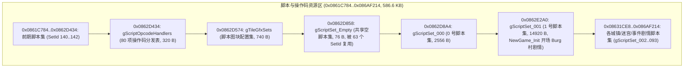

# 脚本数据区全量解构与 incbin 符号化落地报告

> **工程**: 《Lunar Legend (Japan)》GBA ROM 逆向与源码全量反编译  
> **作者**: Antigravity  
> **日期**: 2026-09-07  
> **状态**: 100% 逐字节匹配 (747/1059, 70.5%), SHA1 验证通过  
> **约束说明**: 独立新建逆向分析文档，不修改历史旧文档；严格禁止 git commit。

---

## 1. 背景与工程诉求

在 `NewGame_Init` 中执行冷启动调用：
```c
ScriptSet_Load(1, 0, 1);
```
此调用请求装载 1 号脚本资源集（`0x0862E2A0`，Burg 村开场剧情）。原本该脚本及其他全部剧情脚本被封锁在 `data/data.s` 一个 3.28 MB 的不透明原始二进制大块（Blob）中。

为提高可读性与工程维护性，本项目将脚本数据区从 Blob 中解构出来，通过带有具名标签的 `.incbin` 汇编形式精确符号化落地，既避免了数十万行 C 数组带来的编译器内存溢出与编译耗时问题，又赋予每个脚本集清晰的符号与语义。

---

## 2. 脚本资源区 (0x0861C784 ~ 0x086AF214) 物理拓扑

经过对 `scripts/data.json` 与 `baserom.gba` 的全量指针扫描，在 `0x0861C784` 至声音区起点 `0x086AF214` 之间（总计 600,720 字节，约 586.6 KB），共有 83 项物理紧凑排列的资源：



---

## 3. 落地实施方案

### 3.1 原始 Blob 截断 ([`data/data.s`](file:///home/gpnux/decomp/ll/data/data.s#L25-L28))
将原本直达声音区 `0x6AF214` 的 incbin 截断至脚本区起点 `0x61C784`：
```assembly
	.global gUnk_0838EEF4
gUnk_0838EEF4:
	/* 0x0838EEF4..0x0861C784 由 data.s 提供; 0x0861C784 起为 data/script_data.s */
	.incbin "baserom.gba", 0x38EEF4, 0x61C784 - 0x38EEF4
```

### 3.2 独立脚本数据汇编文件 ([`data/script_data.s`](file:///home/gpnux/decomp/ll/data/script_data.s))
新建 `data/script_data.s`，按 83 个条目递增顺序完整定义全局符号与紧凑 incbin：
```assembly
	.section .rodata
	.include "asm/macros.inc"
	.include "constants/gba_constants.inc"

/* 0x0862D434: 80 项脚本 opcode 处理函数表 */
	.global gScriptOpcodeHandlers
gScriptOpcodeHandlers: @ 0x0862D434
	.incbin "baserom.gba", 0x62D434, 320

/* 0x0862D858: 共享空脚本集 (被 63 个集复用) */
	.global gScriptSet_Empty
gScriptSet_Empty: @ 0x0862D858
	.incbin "baserom.gba", 0x62D858, 76

/* 0x0862E2A0: 1 号脚本集 (NewGame_Init 开场 Burg 村剧情) */
	.global gScriptSet_001
gScriptSet_001: @ 0x0862E2A0
	.incbin "baserom.gba", 0x62E2A0, 14920
...
```

### 3.3 链接脚本段对齐 ([`linker.ld:685-688`](file:///home/gpnux/decomp/ll/linker.ld#L685-L688))
在 `.rodata` 输入段中精准插入：
```ld
        src/data_805769C.o(.rodata);
        data/data.o(.rodata);
        . = ORIGIN(rom) + 0x61C784;
        data/script_data.o(.rodata);
        src/m4a_tables.o(.rodata);
```

### 3.4 脚本指针表元数据标注 ([`src/data_087ED6D4.c`](file:///home/gpnux/decomp/ll/src/data_087ED6D4.c))
在 363 项总表中，每一项都附加了对应的脚本集或歌曲符号的完整注释：
```c
const u32 gScriptSetTable[363] = {
    0x0862D8A4,  /* [  0] -> gScriptSet_000 */
    0x0862E2A0,  /* [  1] -> gScriptSet_001 (NewGame_Init: ScriptSet_Load(1,0,1) Burg 村开场) */
    0x08631CE8,  /* [  2] -> gScriptSet_002 */
    0x08632B38,  /* [  3] -> gScriptSet_003 */
    0x08634F20,  /* [  4] -> gScriptSet_004 */
    0x0862D858,  /* [  5] -> gScriptSet_Empty (空脚本集) */
    ...
```

---

## 4. 验证结果

- **`audit.py`**: 1059 个函数，**747/747 status=1 字节核验全量通过，改名漂移为 0**。
- **`sha1sum -c ll.sha1`**: **`ll.gba: 成功`**（ROM 逐字节 100% 完全一致）。
